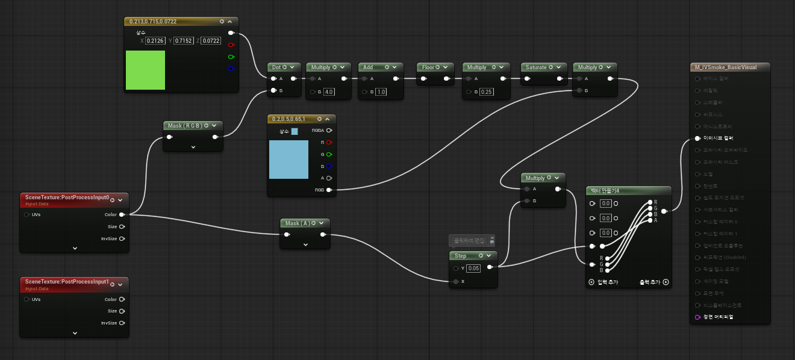

# Custom Material Guide

## Material

### Demo Example



- Material Domain : PostProcess


- **SmokeTexture**: Create a **SceneTexture** node → Scene Texture ID: **[PostProcessInput0]**
- **SmokeLocalPosAlphaTexture (LocalPos(x,y,z), Alpha)**: Create a **SceneTexture** node → Scene Texture ID: **[PostProcessInput1]**
- **SmokeWorldPosDepthTexture (WorldPos(x,y,z), Depth)**: Create a **SceneTexture** node → Scene Texture ID: **[PostProcessInput4]**
- **Output**: **Emissive Color (RGB)**

---

## ProjectSetting Rendering


- **Render Pass**: Information about render order (not covered in detail on this page)
- **Smoke Visual Material**: User-custom smoke material slot
    - If empty, the system returns **SmokeTexture** as-is
- **Visual Alpha Type**: Defines how the smoke alpha is processed
    - **Use Alpha**: Use the alpha value as-is
    - **CutOff**: `(Alpha ≤ AlphaThreshold ? 0 : 1)`
- **Alpha Threshold**: Threshold value used in **Visual Alpha Type = CutOff** mode
- **Low Opacity Remap Threshold**: Handling of very low alpha values

```
if (SmokeAlpha < LowOpacityRemapThreshold)
{
	SmokeAlpha = max(0.0, (SmokeMask - LowOpacityRemapThreshold * 0.5f) * 2.0);
}
```

---

## Example

**Demo Material Path** : Plugins → IVSmoke → Materials → M_IVSmoke_BasicVisual


[IVSmoke_Option_Material.mp4](IVSmoke_Option_Material.mp4)

---

*Copyright (c) 2026, Team SDB. All rights reserved.*