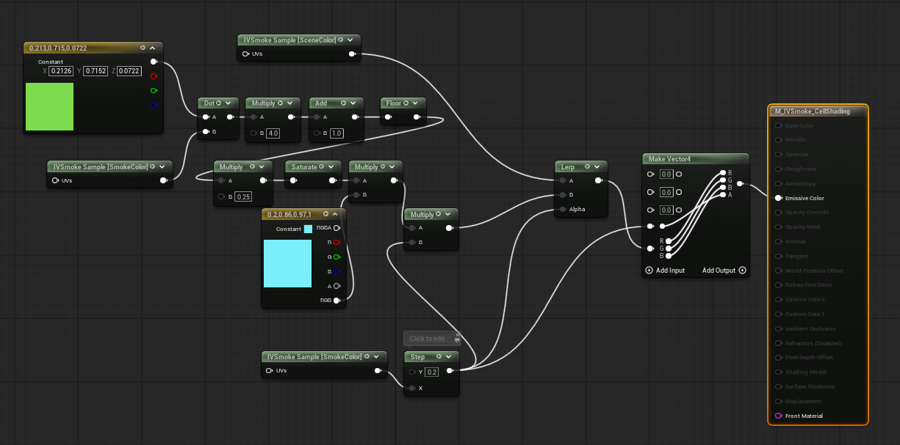
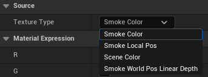

# Custom Material Guide

## Material
### You must define how you want to mix the Scene and Smoke textures.
### Demo Example

- Material Domain : PostProcess

### Expanssion Node
- You can search and add the IVSmoke_TextureSample node.

- The IVSmoke_TextureSample node is configured as follows.

- **Texture Type**
    - **SmokeColor** : Smoke color texture (SmokeAlbedo(R, G, B), SmokeAlpha)
    - **SmokeLocalPos** : Smoke local position texture (Local Position(x, y, z), 0)
    - **SceneColor** : Scene Color Texture 
    - **SmokeWorldPosLinearDepth** : Smoke world position and linear depth (World Position (x, y, z), Linear Depth)

- These textures are mapped to PostProcessInput[0, 1, 2, 4] on the SceneTexture node..

- **Color Mask** : Choose the color channel you want and use it

---

## Visual Material Preset

### Create
Content Drawer → Right-click → Miscellaneous → Data Asset → Select [IVSmoke Visual Material Preset]

### Configuration

- **Smoke Visual Material**: User-custom smoke material slot
    - If empty, it will be rendered through a simple composite shader.
- **UpSample Filter Type** : This filter is applied after upsampling the raymarching results.
    - **None** : Disable filters.
    - **Sharpen**: Enhances edges and details, making smoke contours more defined.
    - **Blur**: Softens with Gaussian blur for natural, smooth smoke appearance.
    - **Median**: Removes noise while preserving edges for clean smoke rendering.

---
## Project Setting Visual Material Preset

- **Search project setting for IVSmoke**
- **In the Rendering section, insert it into the Smoke Visual Material Preset slot.**
---

## Example

**Demo Material Path** : Plugins → IVSmoke → DataAssets → D_IVSmoke_VisualMaterialPreset

[IVSmoke_Option_Material.png](IVSmoke_Option_Material.png)

---

*Copyright (c) 2026, Team SDB. All rights reserved.*